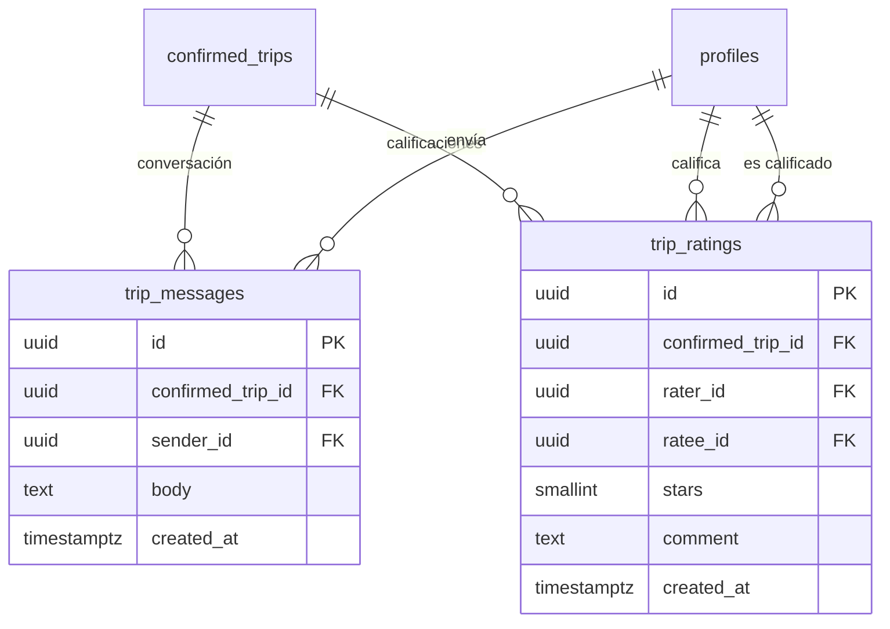

# Diseño — Chat conductor/pasajero y Calificaciones

**Estado:** AMBAS secciones implementadas — Chat (sección A) el 2026-08-26/27, Calificaciones (sección B) el 2026-08-27. Este documento ahora sirve como referencia de arquitectura + registro de las decisiones de producto que se confirmaron con el usuario (ver B.7); donde el código real difiere del borrador original de una sección, se anota explícitamente ahí mismo en vez de reescribir el borrador.
**Fecha:** 24 de agosto de 2026 (diseño original) — actualizado 27 de agosto de 2026 (implementación de calificaciones + decisiones confirmadas).
**Depende de:** [`esquema_base_datos.md`](./esquema_base_datos.md) (esquema base) y de las migraciones aplicadas hasta `0011_calificaciones.sql`.
**Siguiente número de migración libre:** `0012`.

Dos pendientes que el usuario agregó al backlog: (1) chat entre conductor y pasajero cuando tienen un viaje entre ellos, y (2) calificaciones (ratings) entre conductores y pasajeros por perfil. Este documento diseñó el modelo de datos, RLS, arquitectura de entrega (realtime para el chat, agregados denormalizados para las calificaciones) y los puntos de integración con la UI existente — siguiendo los mismos patrones ya establecidos en el proyecto (ver `esquema_base_datos.md` y las migraciones `0008`/`0009`). Ambas secciones ya están implementadas; ver `PROGRESS.md` (entradas del 27 de agosto) para el detalle de cada entrega.

---

## 0. Dónde encajan en el esquema existente



Ambas features cuelgan de `confirmed_trips`, no de `trip_offers` ni de `trip_matches` — tiene sentido de producto (solo tiene sentido chatear o calificar una vez que el viaje ya está confirmado entre dos personas específicas) y también simplifica muchísimo la seguridad: a diferencia de `trip_offers` (donde había que ocultar direcciones/datos de gente con la que todavía no hay match, de ahí las funciones `service_role` en `0002_functions.sql`), `confirmed_trips` ya identifica exactamente a los dos únicos usuarios involucrados (`driver_id`, `passenger_id`). Eso significa que **tanto el chat como las calificaciones se pueden proteger con RLS normal, sin necesitar ninguna función `service_role`** — es la misma razón por la que `confirmed_trips` ya tiene una política tan simple ("visibles solo para conductor y pasajero del viaje").

---

## A. Chat conductor/pasajero

### A.1 Tabla `trip_messages`

```sql
create table public.trip_messages (
  id uuid primary key default gen_random_uuid(),
  confirmed_trip_id uuid not null references public.confirmed_trips (id) on delete cascade,
  sender_id uuid not null references public.profiles (id),
  body text not null check (char_length(btrim(body)) between 1 and 1000),
  created_at timestamptz not null default now()
);

create index trip_messages_trip_idx on public.trip_messages (confirmed_trip_id, created_at);
```

`sender_id` no se restringe aquí a "driver_id o passenger_id de ese confirmed_trip" con un `check` porque un `check` no puede consultar otra tabla — esa validación vive en la política RLS de `insert` (abajo) y, del lado del servidor, en el Server Action como defensa en profundidad (mismo patrón que ya usa `responderSolicitud` en `lib/actions/solicitudes.ts`).

### A.2 RLS

```sql
alter table public.trip_messages enable row level security;

create policy "involved users read messages" on public.trip_messages
  for select using (
    exists (
      select 1 from public.confirmed_trips ct
      where ct.id = confirmed_trip_id
        and (ct.driver_id = auth.uid() or ct.passenger_id = auth.uid())
    )
  );

create policy "involved users send messages" on public.trip_messages
  for insert with check (
    sender_id = auth.uid()
    and exists (
      select 1 from public.confirmed_trips ct
      where ct.id = confirmed_trip_id
        and (ct.driver_id = auth.uid() or ct.passenger_id = auth.uid())
    )
  );
```

Nadie puede editar ni borrar mensajes (no hay política de `update`/`delete`) — igual que un chat real, una vez mandado el mensaje se queda. Si más adelante se quiere "borrar para mí" o edición, es una feature aparte.

### A.3 Entrega en tiempo real

Mismo patrón que el feed del home (`0009_feed_tiempo_real.sql`: **Realtime Broadcast desde la base de datos**, no "Postgres Changes"), pero aquí con una diferencia importante: como el canal se puede autorizar exactamente a los dos usuarios del viaje (no a "toda la institución" como el feed), **sí es seguro incluir el contenido real del mensaje en el broadcast** — no hace falta el truco de "solo mandar una señal y volver a pedir los datos por un camino con `service_role`" que usa el feed.

```sql
-- Canal privado por viaje confirmado: chat-<confirmed_trip_id>
drop policy if exists "chat escuchable solo por conductor y pasajero del viaje" on realtime.messages;

create policy "chat escuchable solo por conductor y pasajero del viaje"
on realtime.messages
for select
to authenticated
using (
  realtime.messages.extension = 'broadcast'
  and exists (
    select 1 from public.confirmed_trips ct
    where 'chat-' || ct.id::text = realtime.topic()
      and (ct.driver_id = auth.uid() or ct.passenger_id = auth.uid())
  )
);

create or replace function public.notificar_mensaje_nuevo()
returns trigger
security definer
set search_path = ''
language plpgsql
as $$
begin
  perform realtime.send(
    jsonb_build_object(
      'id', new.id,
      'sender_id', new.sender_id,
      'body', new.body,
      'created_at', new.created_at
    ),
    'nuevo_mensaje',
    'chat-' || new.confirmed_trip_id::text,
    true
  );
  return new;
end;
$$;

drop trigger if exists trip_messages_notificar_mensaje_nuevo on public.trip_messages;

create trigger trip_messages_notificar_mensaje_nuevo
after insert on public.trip_messages
for each row
execute function public.notificar_mensaje_nuevo();
```

### A.4 Server Actions (`lib/actions/mensajes.ts`, nuevo)

- `obtenerMensajes(confirmedTripId: string)` — valida que el usuario actual sea `driver_id` o `passenger_id` del viaje (defensa en profundidad; RLS ya lo exigiría), regresa el historial ordenado por `created_at` junto con el nombre de la contraparte (para el encabezado del chat).
- `enviarMensaje(confirmedTripId: string, body: string)` — valida con Zod (`body` no vacío, máximo 1000 caracteres, `trim()`), inserta el mensaje. No hace falta `revalidatePath` porque la entrega es por Realtime, no por refetch de página (mismo razonamiento que ya se documentó para `FeedRealtime`).

### A.5 UI

- Ruta nueva: `app/(app)/chat/[tripId]/page.tsx` — server component. Verifica sesión + pertenencia al viaje (si no, `redirect` o 404), llama `obtenerMensajes`, renderiza un client component `<ChatWindow tripId={...} mensajesIniciales={...} miId={...} />`.
- `components/chat-window.tsx` (nuevo, client) — lista de mensajes (alineados izquierda/derecha según `sender_id === miId`, mismo patrón visual que cualquier chat), input + botón de enviar (llama a `enviarMensaje` vía `useActionState`/`useTransition`), y un `useEffect` que se suscribe al canal `chat-<tripId>` igual que `FeedRealtime` (incluye `supabase.realtime.setAuth()` antes de suscribirse — se les olvida fácil y sin eso la política de `realtime.messages` rechaza en silencio, ya pasó con el feed) y aplica el mensaje nuevo al estado local en cuanto llega, sin pedir de nuevo toda la lista.
- Punto de entrada: agregar un botón "Chat" a las tarjetas de viaje de `/manana` (`app/(app)/manana/page.tsx`) — es donde el usuario ya ve sus viajes confirmados próximos. Opcionalmente también en `/historial` para viajes pasados (útil si quedó pendiente coordinar algo). `id="chat-link-<tripId>"` para que sea localizable en Playwright sin depender de texto.
- Ids sugeridos para automatización: `id="mensaje-input"` en el textarea, `id="enviar-mensaje-submit"` en el botón de enviar, `id={`mensaje-${mensaje.id}`}` en cada burbuja de mensaje.

### A.6 Decisiones de producto pendientes de confirmar

1. ¿El chat se cierra (deja de aceptar mensajes nuevos, aunque siga visible el historial) si el viaje se cancela o ya pasó, o se queda abierto siempre para esos dos usuarios? Por simplicidad el diseño de arriba lo deja siempre abierto — es la opción más barata de implementar y probar.
2. ¿Hace falta un indicador de "no leído" (badge en `/manana`)? No está en el diseño de arriba a propósito, para no bloquear la primera versión — se puede agregar después con una tabla `trip_message_reads (confirmed_trip_id, user_id, last_read_at)` sin tocar nada de lo de arriba.
3. ¿Notificación push/correo cuando llega un mensaje y el usuario no tiene la app abierta? Fuera de alcance de este diseño (depende de si se conecta un proveedor de push/correo, ver `PROGRESS.md` Fase 4).

---

## B. Calificaciones (ratings)

**Estado: implementado (2026-08-27)** — ver `supabase/migrations/0011_calificaciones.sql`, `lib/actions/calificaciones.ts`, `components/calificar-form.tsx`, `components/rating-badge.tsx`. Las secciones de abajo se actualizaron para reflejar el diseño FINAL (las decisiones de B.7 ya están confirmadas, no pendientes) — donde el diseño final difiere del borrador original se marca explícitamente.

### B.1 Precondición: hace falta poder marcar un viaje como `completado`

`confirmed_trip_status` ya tiene el valor `'completado'` en el enum (`0001_init_schema.sql`), pero **nada en el código lo pone hoy** — todos los viajes confirmados se quedan en `'programado'` para siempre. Para que calificar tenga sentido (calificar después de que el viaje ya ocurrió, no antes), hace falta cerrar ese hueco primero. Se propone extender el mismo mecanismo de `pg_cron` que ya limpia `trip_offers` vencidas (`0002_functions.sql`, punto 4):

```sql
create or replace function public.complete_past_confirmed_trips()
returns void
language sql
as $$
  update public.confirmed_trips
  set status = 'completado'
  where status = 'programado'
    and scheduled_time < now() - interval '3 hours';
$$;

select cron.schedule(
  'complete-past-confirmed-trips',
  '*/15 * * * *',
  $$ select public.complete_past_confirmed_trips(); $$
);
```

El colchón de 3 horas es arbitrario — ajustar según qué tan largos son los viajes reales. Alternativa (más trabajo, no recomendada para el MVP): un botón manual "Marcar como completado" para cada parte, que solo cierra el viaje cuando ambos lo confirman — más preciso pero es una feature aparte y no es necesaria para poder calificar.

**Decisión confirmada:** automático por tiempo (la alternativa manual queda descartada por ahora). El usuario planteó un punto importante al confirmar esto: sin pagos reales en la app (ver `lib/pricing.ts` — el precio es solo un estimado, el dinero se arregla entre las dos personas fuera de WEPOOL, eso es Fase 4/5+), ¿cómo se evita que dos cuentas fabriquen viajes que nunca ocurrieron para inflarse la reputación mutuamente? No se puede eliminar ese riesgo del todo sin pagos reales o verificación de identidad — ninguno de los dos existe hoy — pero sí se puede subir su costo. Se agregó un guardarraíl nuevo, no contemplado en el borrador original: un trigger `BEFORE INSERT` en `confirmed_trips` que bloquea un tercer viaje confirmado el mismo día calendario (CDMX) entre el mismo par conductor/pasajero (2 es el uso legítimo normal: ida y regreso) — ver `limitar_viajes_confirmados_por_dia()` en `0011_calificaciones.sql`. La decisión de moderación de contenido (reportar/ocultar comentarios abusivos) se dejó explícitamente fuera de alcance de esta primera versión — el producto hoy no tiene ningún mecanismo de moderación en ningún lado, agregar uno completo es una feature aparte.

### B.2 Tabla `trip_ratings`

```sql
create table public.trip_ratings (
  id uuid primary key default gen_random_uuid(),
  confirmed_trip_id uuid not null references public.confirmed_trips (id) on delete cascade,
  rater_id uuid not null references public.profiles (id),
  ratee_id uuid not null references public.profiles (id),
  stars smallint not null check (stars between 1 and 5),
  comment text check (char_length(comment) <= 500),
  created_at timestamptz not null default now(),

  constraint rater_and_ratee_differ check (rater_id <> ratee_id),
  constraint one_rating_per_trip_per_rater unique (confirmed_trip_id, rater_id)
);

create index trip_ratings_ratee_idx on public.trip_ratings (ratee_id);
```

`unique (confirmed_trip_id, rater_id)` es lo que evita que alguien califique el mismo viaje dos veces — el `insert` simplemente falla la segunda vez (o se hace `upsert` si se quiere permitir editar la calificación, ver decisión pendiente abajo).

**Diseño final (difiere de este borrador):** calificación EDITABLE confirmada — `calificarViaje` (`lib/actions/calificaciones.ts`) hace `upsert` sobre `(confirmed_trip_id, rater_id)`, no `insert` simple. Además se agregó una opción "esto no ocurrió" (`no_show`) no contemplada en el borrador original, para que el bloqueo obligatorio (ver B.7) no atrape a nadie calificando un viaje fantasma: `stars` es NULLABLE, hay una columna `no_show boolean` nueva, y un constraint `stars_xor_no_show` que exige que una fila sea calificación real (stars 1–5, no_show false) O reporte de no-show (stars null, no_show true), nunca ambas. Ver la tabla real en `0011_calificaciones.sql`.

### B.3 RLS

```sql
alter table public.trip_ratings enable row level security;

create policy "involved users insert rating" on public.trip_ratings
  for insert with check (
    rater_id = auth.uid()
    and exists (
      select 1 from public.confirmed_trips ct
      where ct.id = confirmed_trip_id
        and ct.status = 'completado'
        and ((ct.driver_id = auth.uid() and ct.passenger_id = ratee_id)
          or (ct.passenger_id = auth.uid() and ct.driver_id = ratee_id))
    )
  );

create policy "select own given or received ratings" on public.trip_ratings
  for select using (rater_id = auth.uid() or ratee_id = auth.uid());
```

Nota: esta política de `select` **no** deja que un usuario vea las calificaciones que le pusieron a un tercero desconocido (ni siquiera el promedio) — para eso está el agregado denormalizado del punto B.4, que se expone por un camino distinto (igual que `driverFirstName` en el feed no se lee directo de `profiles`, se expone a través de una función controlada).

**Diseño final (difiere de este borrador):** comentarios PÚBLICOS confirmado — la política de `select` real es `for select to authenticated using (true)`, cualquier usuario logueado de WEPOOL puede leer cualquier fila de `trip_ratings` (comentario incluido, no solo el promedio). Nota de alcance: esto expone comentarios de cualquier institución a cualquier otra (WEPOOL es multi-institucional) — no hay hoy ninguna forma de navegar entre instituciones desde la UI, así que en la práctica no importa, pero queda documentado. También se agregó una política de `update` (`"rater updates own rating"`, misma condición que `insert`) que no existía en este borrador — necesaria por la decisión de calificación editable (ver B.2). Ver las tres políticas reales en `0011_calificaciones.sql`.

### B.4 Promedio visible antes de calificar: agregado en `profiles`

Para mostrar "★ 4.8 (12)" en las tarjetas del feed o de `/consultar` (donde el otro usuario todavía no tiene ningún viaje confirmado contigo, así que la política de "select matched profile" de `profiles` no aplicaría), hace falta un agregado que sea seguro de exponer ampliamente — el promedio y el conteo no son sensibles por sí mismos, a diferencia de los comentarios individuales.

```sql
alter table public.profiles
  add column rating_avg numeric(2,1),
  add column rating_count integer not null default 0;

create or replace function public.actualizar_rating_agregado()
returns trigger
security definer
set search_path = ''
language plpgsql
as $$
begin
  update public.profiles
  set rating_count = sub.cnt,
      rating_avg = sub.avg
  from (
    select ratee_id, count(*) as cnt, round(avg(stars)::numeric, 1) as avg
    from public.trip_ratings
    where ratee_id = new.ratee_id
    group by ratee_id
  ) sub
  where profiles.id = sub.ratee_id;
  return new;
end;
$$;

drop trigger if exists trip_ratings_actualizar_agregado on public.trip_ratings;

create trigger trip_ratings_actualizar_agregado
after insert on public.trip_ratings
for each row
execute function public.actualizar_rating_agregado();
```

`security definer` es necesario aquí por la misma razón que en `notificar_oferta_disponible` (0009): el trigger tiene que poder actualizar la fila de `profiles` de **otra persona** (el `ratee`, no quien dispara el trigger), y la política `"update own profile"` de `profiles` no lo permitiría en modo `invoker`.

**Diseño final (difiere de este borrador):** dos cambios, ambos consecuencia de las decisiones de arriba. (1) `count(stars)` en vez de `count(*)` en la subconsulta — así las filas `no_show` (stars null) no inflan `rating_count` ni ensucian `rating_avg` de nadie (`avg()` de Postgres ya ignora nulls por sí solo, pero `count(*)` sí las contaría). (2) el trigger dispara en `after insert or update` (antes solo `insert`) — con calificación editable, cambiar una calificación ya puesta también debe recalcular el agregado. Ver la función real en `0011_calificaciones.sql`.

Con `rating_avg`/`rating_count` ya en `profiles`, dos caminos para exponerlos donde hace falta:

1. **Antes de tener match** (tarjetas del feed, candidatos en `/consultar`): extender las funciones `service_role` existentes (`find_driver_offers_near`/`find_candidate_offers` en `0002`/`0003`, y `obtenerFeed`/`obtenerSolicitudesPendientesConductor` en `lib/actions/feed.ts`/`solicitudes.ts`) para que también seleccionen `rating_avg`/`rating_count` del `profiles` correspondiente y los incluyan en lo que ya regresan hoy (junto a `driverFirstName`, etc.) — mismo patrón, no hace falta ninguna política de RLS nueva porque estas funciones ya corren con privilegios elevados y ya deciden explícitamente qué exponer.
2. **Después de match** (`/manana`, `/historial`, `/chat/[tripId]`): ya se puede leer directo vía la política `"select matched profile"` que ya existe, sin cambios.

### B.5 Server Actions (`lib/actions/calificaciones.ts`, implementado)

- `calificarViaje({ confirmedTripId, noShow, stars?, comment? })` — valida con Zod (`stars` entero 1–5 requerido salvo que `noShow: true`, `comment` opcional ≤500 caracteres), valida que el viaje esté `'completado'` y que el usuario actual sea una de las dos partes, calcula `ratee_id` como la contraparte, hace `upsert` (no `insert` — editable, ver B.2). `revalidatePath("/historial")` y `revalidatePath("/reserva")` al terminar (a diferencia del chat, aquí sí conviene refrescar server-rendered porque no hay ninguna suscripción en vivo esperando el cambio, y `/reserva` puede pasar de bloqueada a desbloqueada).
- `obtenerViajesPorCalificar()` — lista completa (con nombre de contraparte) de viajes `completado` que el usuario todavía no calificó; la usa `app/(app)/reserva/page.tsx` para la tarjeta de bloqueo.
- `tieneViajesSinCalificar(supabase, userId)` — versión ligera (solo booleano, reutiliza un cliente ya creado) para los tres guardas de bloqueo, ver B.7 punto 3.

### B.6 UI (implementado)

- `/historial` (`app/(app)/historial/page.tsx`): en cada tarjeta con `status === "completado"` se renderiza `<CalificarForm>` (`components/calificar-form.tsx`) — selector de 1–5 estrellas (ícono `Star` de `lucide-react`), botón "No se realizó", textarea opcional de comentario, botón enviar/guardar. Si el usuario ya calificó ese viaje, se muestra en modo lectura con un botón "Editar" (editable, ver B.2). También muestra el nombre de la contraparte + `<RatingBadge>` junto a la fecha/dirección de cada tarjeta, para cualquier status, no solo `completado`.
- `<RatingBadge avg count>` (`components/rating-badge.tsx`) — "★ 4.8 (12)"; no renderiza nada si `count` es 0 (usuario nuevo sin calificaciones) en vez de mostrar "★ 0.0". Implementado en `/manana` y `/historial` (pantallas post-match, la política `"select matched profile"` de `profiles` ya permite leer `rating_avg`/`rating_count` de la contraparte sin cliente admin). **Pendiente:** feed del home y `/consultar` (pre-match) — ahí sí hace falta extender `find_driver_offers_near`/`find_candidate_offers` (B.4 punto 1) porque esas pantallas no tienen ningún `confirmed_trip` todavía que autorice leer el perfil de la contraparte.
- `components/ui/textarea.tsx` — ya existía (se creó para el chat, `docs/...` sección A), reutilizado aquí sin cambios.
- Fuera de alcance de esta implementación, natural como siguiente paso: una pantalla `/perfil` que muestre el promedio propio y la lista de comentarios recibidos — hoy no existe ninguna pantalla de perfil en el producto.

### B.7 Decisiones de producto — confirmadas con el usuario el 2026-08-27

1. **¿Se puede editar una calificación ya puesta?** Sí — `upsert` sobre `(confirmed_trip_id, rater_id)` + política de `update` en RLS. Ver B.2/B.3.
2. **¿Los comentarios de texto son públicos o solo el promedio numérico?** Públicos — cualquier usuario autenticado de WEPOOL puede leer cualquier comentario, no solo el promedio. Se dejó fuera de alcance, a propósito, cualquier mecanismo de moderación (reportar/ocultar) — el producto no tiene ninguno hoy en ningún lado. Ver B.3.
3. **¿Calificación obligatoria u opcional?** Obligatoria, con bloqueo real: `crearOferta` (`lib/actions/reserva.ts`), `unirmeAViaje` (`lib/actions/feed.ts`) y `elegirCandidato` (rama pasajero, `lib/actions/consultar.ts`) rechazan la acción con `MENSAJE_BLOQUEO_SIN_CALIFICAR` mientras el usuario tenga algún viaje `completado` sin calificar; `app/(app)/reserva/page.tsx` además muestra una tarjeta de bloqueo en vez del formulario, para no dejar que alguien llene todo el formulario solo para enterarse hasta el final. Para que el bloqueo real no atrape a alguien calificando un viaje que nunca ocurrió (no-show), se agregó la opción "Este viaje no se realizó" (ver B.2) — cuenta como calificación para desbloquear, sin afectar el promedio de nadie.
4. **Colchón de `complete_past_confirmed_trips()`:** se confirmó el enfoque automático por tiempo (3 horas), no el manual de "ambos confirman". Al confirmar esta decisión, el usuario planteó un punto importante sobre fraude/pagos — ver la nota extendida en B.1: se agregó un guardarraíl nuevo (anti-colusión, máximo 2 viajes confirmados por par de usuarios por día) que no estaba en el borrador original de este documento.

---

## C. Orden de implementación

1. ~~**Chat primero**~~ — ✅ implementado 2026-08-26/27, ver `PROGRESS.md`.
2. ~~**`complete_past_confirmed_trips()`**~~ (B.1) — ✅ implementado 2026-08-27, con el guardarraíl anti-colusión agregado (ver B.1/B.7 punto 4).
3. ~~**`trip_ratings` + agregado en `profiles`**~~ (B.2–B.4) — ✅ implementado 2026-08-27.
4. ~~**UI de calificación en `/historial`**~~ (B.5–B.6) — ✅ implementado 2026-08-27, incluyendo la tarjeta de bloqueo en `/reserva` (B.7 punto 3).
5. **Badges de calificación en el resto de pantallas** (feed del home, `/consultar`) — ⬜ pendiente. `/manana` y `/historial` ya los muestran (post-match, sin necesitar cambios de RLS); el feed y `/consultar` son pre-match y requieren extender `find_driver_offers_near`/`find_candidate_offers` para regresar `rating_avg`/`rating_count` (ver B.4 punto 1) — deliberadamente no incluido en esta entrega para no arriesgar romper esas dos funciones ya complejas sin poder correr la suite de pruebas contra Supabase real desde este entorno de trabajo.

## D. Casos de uso (ver `docs/casos_de_uso.md`)

Ya agregados: sección G (`CU-CHAT-01/02`) y sección H (`CU-RATE-01` a `CU-RATE-06`), más `CU-E2E-08` (chat) y `CU-E2E-09` (flujo completo de calificación) en la sección D de ese documento. Ninguno tiene spec de Playwright todavía — son el backlog de pruebas, igual que el resto del catálogo. CU-CHAT-02 y CU-RATE-02 en particular valen la pena como pruebas negativas explícitas de RLS (crear un tercer usuario sin relación al viaje e intentar leer/escribir, esperando que falle), algo que la suite actual todavía no prueba para ninguna tabla.
