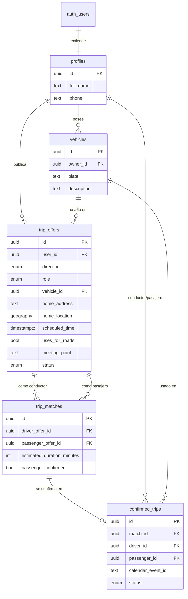

# Esquema de base de datos — Carpool ITAM

**Estado:** diseño listo para aplicar (migraciones en `supabase/migrations/`)
**Fecha:** 14 de agosto de 2026
**Depende de:** [`arquitectura_mvp.md`](./arquitectura_mvp.md) — PostgreSQL (Supabase) + PostGIS.

Este documento detalla el esquema que reemplaza las tablas de la tesina (`Usuarios`, `Viajes_Ida_Pasajero`, `Viajes_Ida_Conductor`, `Viajes_Regreso_Conductor`, `Viajes_Regreso_Pasajero`, `Viajes_Asignados_Ida`, `Viajes_Asignados_Regreso`, `Viajes`) y explica el porqué de cada cambio. El SQL ejecutable está en:

- `supabase/migrations/0001_init_schema.sql` — extensiones, tipos, tablas, índices, Row Level Security.
- `supabase/migrations/0002_functions.sql` — automatizaciones: creación de perfil, restricción de dominio institucional, emparejamiento geoespacial, limpieza de reservas vencidas.

---

## 1. Diagrama entidad-relación



---

## 2. Por qué una sola tabla `trip_offers` en vez de cuatro

La tesina tenía `Viajes_Ida_Pasajero`, `Viajes_Ida_Conductor`, `Viajes_Regreso_Conductor` y `Viajes_Regreso_Pasajero` como tablas separadas, con la misma forma pero duplicada cuatro veces. Eso obliga a duplicar cada consulta y cada regla de validación cuatro veces.

`trip_offers` consolida las cuatro con dos columnas: `direction` (`ida`/`regreso`) y `role` (`conductor`/`pasajero`). El extremo fijo del viaje siempre es el campus; `home_address`/`home_location` describen el extremo variable:

- `direction = 'ida'` → `home_location` es el origen (de dónde sale el usuario); el destino es el ITAM.
- `direction = 'regreso'` → `home_location` es el destino (a dónde llega el usuario); el origen es el ITAM.

Reglas específicas de la tesina se mantienen como *constraints* de base de datos en vez de validaciones repetidas en cada endpoint:

- Solo un conductor puede traer `vehicle_id` (`driver_requires_vehicle` / `passenger_has_no_vehicle`).
- Solo un conductor declara preferencia de vías de cuota (`driver_states_toll_preference`).
- Solo el conductor de un viaje de regreso debe indicar `meeting_point` dentro del campus (`driver_regreso_requires_meeting_point`).

Esto significa que un dato inconsistente (por ejemplo, un pasajero con vehículo asignado) no puede ni siquiera insertarse, sin importar qué parte del código lo intente — la tesina dependía de que cada endpoint de Flask validara esto a mano.

---

## 3. Emparejamiento geográfico (`find_candidate_offers`)

La tesina calculaba compatibilidad llamando a la API de Distance Matrix de Google **para cada par** conductor–pasajero disponible. Funciona, pero cada llamada cuesta cuota y tiempo, y crece de forma cuadrática con el número de usuarios.

El nuevo flujo tiene dos pasos:

1. **Pre-filtro en la base de datos** (`find_candidate_offers`, en `0002_functions.sql`): usa el índice espacial GiST de PostGIS para encontrar, en milisegundos, los candidatos más cercanos que además coincidan en dirección, rol opuesto, estatus `buscando` y una ventana de horario razonable (±30 min por default). Esto reduce cientos de comparaciones posibles a un puñado de candidatos reales.
2. **Confirmación con Google Distance Matrix** (desde el servidor, en Next.js): solo para esos pocos candidatos ya pre-filtrados, se llama a Google para calcular el desvío real del conductor y aplicar la regla de negocio de la tesina ("si el viaje con el pasajero no supera el tiempo normal del conductor + 15 minutos, se considera candidato").

**Nota de seguridad:** `find_candidate_offers` es `SECURITY DEFINER` y su ejecución está restringida al rol `service_role` (revocada para `authenticated`/`anon`). Esto es intencional: la función necesita leer `home_location` de otros usuarios para calcular cercanía, pero esa información no debe ser accesible directo desde el navegador de un usuario cualquiera — solo el servidor (Server Action de Next.js con la llave de servicio) puede invocarla, y solo debe devolver al cliente los datos ya filtrados (hora estimada y duración), nunca la dirección exacta de alguien con quien todavía no hay un viaje confirmado. Los datos de contacto y dirección completos solo se exponen vía las políticas de `profiles`/`vehicles` una vez que existe una fila en `confirmed_trips` (sección 5).

---

## 4. Autenticación y verificación institucional

- El registro, la verificación de correo y el guardado seguro de la contraseña ya no se programan a mano: los resuelve **Supabase Auth**.
- **Actualización 2026-08-14:** el plan original era verificación por código de 6 dígitos (OTP por correo). Desde el 3 de junio de 2026, Supabase restringió la personalización de plantillas de correo (necesaria para mandar un código en vez de un link) a proyectos con SMTP propio o plan de pago. Mientras el proyecto siga en el plan gratuito con el correo por default de Supabase, el registro confirma por **link mágico** en vez de código — ver `app/auth/callback/route.ts` en el proyecto Next.js. La restricción de dominio institucional (siguiente punto) y la creación automática de perfil funcionan igual en ambos flujos, no cambia nada del esquema.
- La restricción de dominio institucional se implementa con un *Auth Hook* de Supabase (`restrict_signup_to_itam_domain`, en `0002_functions.sql`, cuerpo actualizado en `0004_instituciones.sql`) que rechaza cualquier registro cuyo dominio de correo no esté dado de alta en la tabla `institutions`, antes de que la cuenta se cree. Se conecta desde el panel de Supabase en *Authentication → Hooks → Before User Created*. ([Documentación oficial](https://supabase.com/docs/guides/auth/auth-hooks/before-user-created-hook))
- Cuando Supabase Auth confirma el registro, el trigger `on_auth_user_created` crea automáticamente la fila correspondiente en `profiles` — equivalente al paso de la tesina de "crear un registro en la tabla de usuarios", pero sin código de aplicación de por medio. Desde `0004_instituciones.sql` también resuelve `institution_id` a partir del dominio del correo.
- **Actualización 2026-08-17 — multi-institución:** el pitch de comercialización del producto es institucional, no exclusivo del ITAM (ver `PROGRESS.md`, sección "Modelo de negocio / pitch"). `0004_instituciones.sql` generaliza el dominio hardcodeado `@itam.mx` a una tabla `institutions` (nombre + dominio de correo), con el ITAM como primer registro/piloto. `find_candidate_offers` ahora también filtra por `institution_id` igual entre ambas ofertas — sin esto, usuarios de dos empresas cliente distintas se emparejarían entre sí, lo cual no tiene sentido para el producto.

---

## 5. De candidato a viaje confirmado

Refleja el flujo de la tesina (mostrar candidatos → elegir uno → borrar las demás reservas):

1. Se calculan candidatos con `find_candidate_offers` + Distance Matrix y se guardan en `trip_matches`.
2. El pasajero elige uno de sus candidatos → `trip_matches.passenger_confirmed = true`.
3. El conductor ve los candidatos donde ya hay un pasajero confirmado y elige uno → la aplicación crea la fila en `confirmed_trips` (con el evento de Google Calendar ya creado) y marca ambas `trip_offers` con `status = 'confirmado'` — equivalente en efecto a lo que pedía la tesina ("El sistema deberá borrar todos los registros de las reservas de cada usuario": las ofertas dejan de ser candidatas para cualquiera), pero sin borrar filas. **Actualización 2026-08-17:** el diseño original de este documento asumía que se podían *borrar* `trip_offers`/`trip_matches` con `on delete cascade`, pero `confirmed_trips.match_id` referencia `trip_matches` sin cascada — a propósito, para conservar el vínculo histórico — así que ese `trip_matches` es, por diseño, imposible de borrar una vez confirmado. Intentarlo revienta por llave foránea (bug real que encontró la suite de Playwright, ver `PROGRESS.md`). La solución fue usar el valor `'confirmado'` que ya existía en el enum `trip_offer_status` sin usarse.
4. `confirmed_trips` sirve tanto para mostrar "los viajes de mañana" como para el historial — reemplaza la tabla `Viajes` de la tesina. Ambas pantallas embeben `trip_matches` (vía `confirmed_trips.match_id`, que sigue existiendo) para reconstruir una estimación de precio/ganancia — ver sección 9.

---

## 6. Limpieza de reservas vencidas

La tesina usaba un hilo de Python que vivía dentro del proceso del servidor Flask — si el servidor se reiniciaba, el hilo (y su temporizador) se perdía. `expire_stale_offers()` corre como tarea programada de **pg_cron** cada 15 minutos directamente en la base de datos (ver `0002_functions.sql`), así que no depende de que ningún servidor esté corriendo.

---

## 7. Regla "solo para el día siguiente"

La tesina restringe: *"Los viajes reservados deberán ser exclusivamente para el día siguiente."* Se deja como validación de aplicación (en el formulario y en el Server Action de Next.js, comparando `scheduled_time` contra "mañana" en la zona horaria de Ciudad de México) en vez de un `CHECK` de base de datos, porque "mañana" cambia cada día y un `CHECK` no puede depender de `now()` de forma confiable en Postgres. Si más adelante se relaja esta regla (por ejemplo, para reservar con varios días de anticipación de cara a una demo o piloto más amplio), es un cambio de una sola validación, no de esquema.

---

## 8. Cómo aplicar esto

Con el proyecto de Supabase ya creado (pendiente en `PROGRESS.md`, fase 1):

```bash
supabase link --project-ref <tu-project-ref>
supabase db push
```

Esto aplica `0001_init_schema.sql` y `0002_functions.sql` en orden. El *Auth Hook* de dominio institucional se conecta aparte, desde el panel (no se activa solo con la migración) — ver sección 4.

---

## 9. Precio y ganancia estimada

El diferenciador competitivo del producto frente a Uber/Didi es el modelo de *micro-earning*: el conductor gana un ingreso marginal por un trayecto que de todos modos iba a hacer (ir al trabajo/la universidad), así que el precio al pasajero puede ser mucho más bajo que un viaje por app tradicional (ver `PROGRESS.md`, sección "Modelo de negocio / pitch").

Para la demo no hay cobro real todavía (eso implica integrar un procesador de pagos, p. ej. Stripe — pendiente de Fase 4/5+). En vez de eso, `lib/pricing.ts` calcula una **estimación** de precio/ganancia a partir de la misma distancia en línea recta que ya se usa para estimar la duración del trayecto compartido (`VELOCIDAD_PROMEDIO_KMH`, ver sección 3) — no depende de ninguna tabla ni columna nueva:

```
precio_pasajero = tarifa_base + tarifa_por_km * distancia_km
ganancia_conductor = precio_pasajero * (1 - comisión_plataforma)
```

Se muestra en `/consultar` (candidatos), `/manana` (viajes confirmados de mañana) y `/historial` (viajes pasados) — las dos últimas reconstruyen la distancia desde `trip_matches.estimated_duration_minutes`, embebido vía `confirmed_trips.match_id`.
